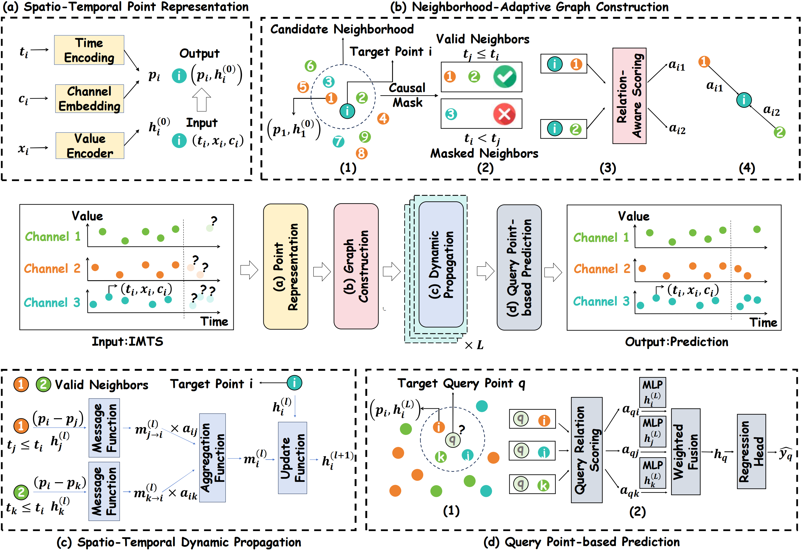

# ASTGI
# Rethinking Irregular Time Series Forecasting:  A Simple yet Effective Baseline

## Introduction

Irregular multivariate time series (IMTS) are prevalent in critical domains like healthcare and finance, where accurate forecasting is vital for proactive decision-making. However, the asynchronous sampling and irregular intervals inherent to IMTS pose two core challenges for existing methods: (1) how to accurately represent the raw information of irregular time series without introducing data distortion, and (2) how to effectively capture the complex dynamic dependencies between observation points. To address these challenges, we propose the Adaptive Spatio-Temporal Graph Interaction (ASTGI) framework. Specifically, the framework first employs a Spatio-Temporal Point Representation module to encode each discrete observation as a point within a learnable spatio-temporal embedding space. Second, a Neighborhood-Adaptive Graph Construction module adaptively builds a causal graph for each point in the embedding space via nearest neighbor search. Subsequently, a Spatio-Temporal Dynamic Propagation module iteratively updates information on these adaptive causal graphs by generating messages and computing interaction weights based on the relative spatio-temporal positions between points. Finally, a Query Point-based Prediction module generates the final forecast by aggregating neighborhood information for a new query point and performing regression. Extensive experiments on multiple benchmark datasets demonstrate that ASTGI outperforms various state-of-the-art methods.

<div align="center">

</div>

Overview of the ASTGI framework. (a) Directly representing each discrete observation as a spatio-temporal point. (b) Adaptively constructing a causal graph for each point. (c) Iteratively propagating information on the adaptive graphs to update features. (d) Unifying prediction as a neighborhood aggregation task for a query point.

## Quickstart
> [!IMPORTANT]
> this project is fully tested under python 3.11, it is recommended that you set the Python version to 3.11 and CUDA version to 12.0
1. Installation:

> ```shell
> pip install -r requirements.txt
> ```

2. Data preparation:
If you want to test the MIMIC dataset, you should follow these steps:
    1. Follow the processing scripts in [gru_ode_bayes](https://github.com/edebrouwer/gru_ode_bayes/tree/master/data_preproc/MIMIC) to generate `complete_tensor.csv`.
    2. Place the resulting file under `~/.tsdm/rawdata/MIMIC_III_DeBrouwer2019/complete_tensor.csv`.
3. Train and evaluate model:

We provide the experiment scripts for all benchmarks under the folder `./APN/scripts`. For example you can reproduce a experiment result as the following:

```shell
bash ./scripts/ASTGI/USHCN.sh
```

